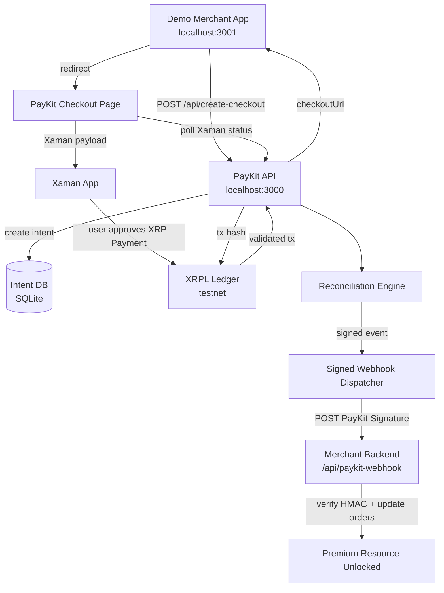

# ARCHITECTURE

> PRD §10. PayKit 시스템 구조 + 데이터 흐름.

## High-level Architecture



## 컴포넌트

### apps/paykit (Next.js, port 3000)

- `/api/v1/payment_intents` POST — intent 생성
- `/api/v1/payment_intents/:id` GET — intent 조회 (status polling)
- `/api/v1/payment_intents/:id/verify` POST — manual verify trigger
- `/api/xaman/callback` POST — fallback
- `/checkout/:intentId` — hosted checkout 페이지
- src/db — Drizzle schema + client
- src/domain — payment-intent · state-machine · memo · drops
- src/services — create-intent · xaman · verify-xrpl · reconcile · webhook
- src/xrpl — xrpl.js client + verify-tx + fixtures
- src/xaman — real client + mock

### apps/demo-merchant (Next.js, port 3001)

- `/` — locked premium UI + event log
- `/api/create-checkout` POST — PayKit SDK 호출
- `/api/paykit-webhook` POST — 서명 검증 + orders 업데이트
- `/api/premium-result` GET — paid 게이팅
- src/paykit-client · orders · verify-paykit-webhook · event-log-store

### packages/sdk

- types · webhooks (sign/verify) · client (PaymentIntentsResource)

## 데이터 흐름 (PRD §7.1 정확본)

```
1. User → demo merchant — locked
2. Click Unlock with XRP
3. merchant backend → POST PayKit /api/v1/payment_intents
4. PayKit DB insert intent (status=created)
5. PayKit → merchant: checkoutUrl
6. merchant → User: redirect to checkout
7. User → PayKit /checkout/:id
8. PayKit creates Xaman payload (real or mock)
9. checkout displays QR + status poller starts
10. User approves in Xaman → tx hash returned
11. PayKit polls Xaman payload status
12. PayKit calls XRPL.tx → verify 9 conditions
13. If pass → reconcile: status pending → succeeded, store txHash
14. Dispatch signed webhook event evt_${intentId}_succeeded
15. merchant /api/paykit-webhook receives → verify HMAC → orders[orderId]=paid
16. merchant /api/premium-result returns content
17. checkout polling sees status=succeeded → close
18. demo merchant polling sees orders[orderId]=paid → unlock UI
```

## 데이터 모델 (PRD §11)

상세: `docs/design/ENTITIES.md`. 요약:

- `payment_intents` — id, status, amountDrops (text), destination, orderId, resourceId, memoHex, xamanPayloadId, txHash (UNIQUE), metadata, expiresAt, ...
- `webhook_events` — id, intentId, type, payloadJson, deliveryStatus, attempts, lastError, (intentId, type) UNIQUE

## 상태 머신 (PRD §8.5)

상세: `docs/design/STATE_MACHINE.md`.

```
created → pending → succeeded
                 → failed
                 → expired → requires_review (if late valid payment)
```

## 외부 의존성

- xrpl.js 4.x — WSS testnet
- @xumm/sdk — Xaman API (real 모드)
- better-sqlite3 + drizzle-orm
- Next.js 14+ App Router
- zod (env validation)
- crypto (Node built-in, HMAC)

## 환경 변수 (PRD §10·§12)

`paykit/.env.example` 참조. 핵심:
- PAYKIT_API_KEY (bearer auth)
- PAYKIT_WEBHOOK_SECRET (HMAC)
- PAYKIT_DATABASE_URL (SQLite)
- PAYKIT_BASE_URL, PAYKIT_WEBHOOK_URL_ALLOWLIST
- XRPL_NETWORK, XRPL_RPC_URL, PAYKIT_MERCHANT_XRPL_ADDRESS
- XAMAN_MODE (mock|real), XAMAN_API_KEY, XAMAN_API_SECRET
- DEMO_MERCHANT_PAYKIT_API_KEY, DEMO_MERCHANT_PAYKIT_WEBHOOK_SECRET

## 배포 (V1+)

MVP는 localhost. V1에서 Vercel 또는 Railway 검토.

## 보안 (PRD §12)

`docs/design/UX_GUIDE.md` + `.claude/agents/paykit-security-review.md` 참조.

핵심:
- PayKit은 자금 custody X (시드·키 보관 X)
- secret은 `.env`만
- API bearer auth
- webhook URL allowlist (SSRF 차단)
- ledger validated tx만 신뢰 (wallet callback 단독 신뢰 X)
- testnet only
